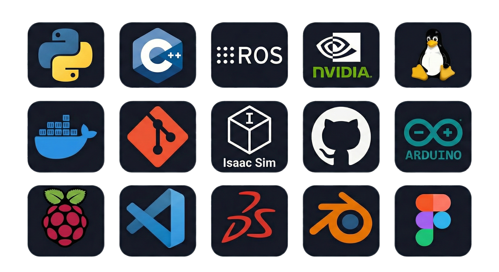

  

<h1 align="center">Jedin J Mathew</h1>

  <b>Robotics Engineer • ROS Developer • Embedded Systems</b>

 

<h2 align="center">✨ Overview</h2>

Focused on building high-precision, intelligent robotic systems through clean engineering, minimal design philosophy, and mathematically grounded control. Combining ROS, embedded systems, and mechanical design to develop modern robotic manipulators and automation stacks.

 

<h2 align="center">⚙️ Core Competencies</h2>

<table align="center" style="border-collapse: collapse; border: none;">
<tr>
<td valign="top" width="33%" style="border: none;">
<h3 align="center">Robotics & Manipulation</h3>
<ul>
<li>Forward/Inverse Kinematics</li>
<li>Jacobians + numerical IK solvers</li>
<li>Trajectory planning (Splines, RRT)</li>
<li>MoveIt planning pipelines</li>
<li>URDF/Xacro kinematic modeling</li>
</ul>
</td>
<td valign="top" width="33%" style="border: none;">
<h3 align="center">ROS Ecosystem</h3>
<ul>
<li>ROS2 Humble</li>
<li>TF2, Actions, Lifecycle nodes</li>
<li>MoveIt servo & IK plugins</li>
<li>Gazebo / Isaac simulation</li>
<li>micro-ROS for embedded nodes</li>
</ul>
</td>
<td valign="top" width="33%" style="border: none;">
<h3 align="center">Embedded & Control</h3>
<ul>
<li>ESP32 / ESP-IDF firmware</li>
<li>Feetech SMS/ST bus-servo control</li>
<li>Sensor fusion (IMU, ToF, Encoders)</li>
<li>Real-time control loops (PID, FF)</li>
</ul>
</td>
</tr>
</table>

<b>Design & Fabrication:</b> SolidWorks multi-body modeling • End-effector mechanism design • High-tolerance prototyping

 

<h2 align="center">🛠️ Tech Stack</h2>

  

 

<h2 align="center">📦 Featured Projects</h2>

### 6-DOF Bus-Servo Manipulator (ROS2 + IK Solver)
* Custom-modeled URDF/Xacro with MoveIt integration.
* Numerical IK solver implemented in Python.
* ESP32 bus-servo bridge with real-time feedback loops.

### Modular 3D-Printed End-Effectors
* Tool-free quick-swap mechanisms.
* Parallel and adaptive grip designs using high-strength PETG.

### Vision-Driven Control Pipeline
* Real-time object tracking and segmentation using OpenCV.
* Mapping vision data directly to actuator velocity commands.

 
<h3 align="center">📸 Project Gallery</h3>

  

 

<h2 align="center">📊 GitHub Insights</h2>

  

 

<h2 align="center">🧩 Specializations</h2>

 

<h2 align="center">🤝 Connect</h2>

  
  
  

 
 

  

  Designing intelligent machines with clarity, precision, and minimalism.

